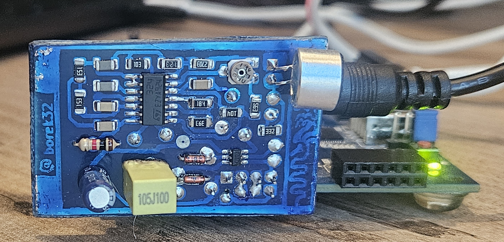

# FPGA MFCC digit recognizer

This repository is the source-and-evidence release of an EEE491 fixed-point
spoken-digit recognizer for the Digilent Basys 3. The design acquires an
external ADC stream and implements the full feature/classification path in
VHDL:

```text
ADC/VAD -> Hann window -> 512-point FFT -> 32-channel Mel bank
        -> log2 approximation -> 8-coefficient DCT -> template comparator
```

The packaged hardware profile is the home-fabricated microphone/ADC board on
Pmod JC. `constraints/jc_homefab.xdc` is the only top-level constraint file in
the release. Generated Vivado projects, checkpoints, bitstreams, logs and
waveform databases are deliberately not versioned.



## What is here

- `rtl/`: the eleven synthesizable VHDL units, with `top_module` as top.
- `testbench/` and `verification/`: eleven VHDL benches, retained fixed-point
  inputs/outputs, MATLAB cross-checks, and a bounded safe regression runner.
- `ip/` and `data/`: twenty AMD IP configuration files and five ROM
  initialization sources. Generated IP products are intentionally absent.
- `constraints/jc_homefab.xdc`: the complete 39-port Basys 3/JC pin profile.
- `hardware/homefab_mic_adc_pcb/`: KiCad sources, photos, verification tools,
  and report figures for the physical microphone/ADC board.
- `hardware/pcb_adc_uart/`: the isolated ADC-to-UART diagnostic and its
  explicitly bounded evidence.
- `implementation/`: retained text reports from the historical main
  run and the final JC-mapped implementation. These reports are evidence, not
  inputs to the clean build.
- `docs/report/EEE491_MFCC_Final_Report_2026-08-20.pdf`: the final project
  report.

## Quick start

Vivado 2025.2 is the reference version. Choose fresh directories outside this
repository; the scripts reject in-tree or pre-existing output directories.
Run Vivado itself from a fresh external runtime directory so journals, logs and
`.Xil` process state never enter the checkout.

```bash
repo_root=$(pwd -P)
build_dir=$(readlink -m ../mfcc-build-v1.0.0)
results_dir=$(readlink -m ../mfcc-results-v1.0.0)
runtime_dir=$(readlink -m ../mfcc-runtime-v1.0.0)
mkdir -- "$runtime_dir"

(
  cd "$runtime_dir"
  vivado -mode batch -notrace \
    -journal "$runtime_dir/01-recreate.jou" \
    -log "$runtime_dir/01-recreate.log" \
    -source "$repo_root/scripts/recreate_project.tcl" \
    -tclargs "$build_dir"

  vivado -mode batch -notrace \
    -journal "$runtime_dir/04-build-jc.jou" \
    -log "$runtime_dir/04-build-jc.log" \
    -source "$repo_root/scripts/build_jc_homefab.tcl" \
    -tclargs "$build_dir" "$results_dir" 4
)
```

The first command copies the release inputs into the external build directory,
creates a new project for `xc7a35tcpg236-1`, and regenerates IP products there.
The second runs synthesis and implementation, validates timing/routing/DRC and
the complete package-pin map, then places reports and a generated bitstream in
the external results directory.

Run the repository integrity and privacy gate with:

```bash
python3 scripts/check_release.py
```

The gate also requires Git's clean-filtered bytes to match the worktree bytes,
so a commit and fresh checkout cannot silently invalidate `SHA256SUMS`.

Or run the complete non-hardware release workflow in fresh external directories:

```bash
scripts/run_release_checks.sh ../mfcc-build-v1.0.0 \
  ../mfcc-results-v1.0.0 --top-smoke --jobs 4
```

`VIVADO_BIN` and `MATLAB_BIN` may name alternate executables. The wrapper runs
the integrity gate, recreation, nine safe XSim benches, optional top smoke,
MATLAB gates, and the full JC build. It creates the fresh external
`../mfcc-results-v1.0.0.runtime/` directory for Vivado process state and never
programs hardware. The MATLAB gate is serialized and refuses to start while
another MATLAB process is active.

See [REPRODUCIBILITY.md](REPRODUCIBILITY.md) for simulation, MATLAB, KiCad and
hardware procedures.

## Verified result and evidence boundary

The retained final JC implementation reports:

- routed setup slack `+0.671 ns` and hold slack `+0.020 ns`;
- 12,824/12,824 routable nets complete, with zero routing errors;
- zero DRC errors, critical warnings, or warnings (11 advisories);
- 5,603 LUTs, 8,437 registers, 23.5 BRAM tiles, and 15 DSPs.

Those are internal FPGA implementation results. The methodology report retains
36 `TIMING-18` warnings because external I/O delays were not characterized;
the ADC board interface is therefore not claimed as board-level timing closed.

The report describes a working bench demonstration and historical recognition
observations. No pre-labeled live session made with the final FFT/Mel-corrected
image was retained, so this release makes no numerical live-accuracy claim.
The earlier 30/30 development set predates those final corrections and is not
presented as final-system accuracy. Photographs show construction and operation;
they do not independently establish recognition accuracy.

The isolated ADC/UART reconstruction closes its declared internal timing, but
its retained CDC report contains 133 `CDC-1` critical findings, 12 `CDC-15`
warnings, and four `CDC-3` informational findings. Its corrected SPI-alignment
candidate passes simulation and implementation; the decisive voltage/UART
endpoint capture remains **NOT RUN**. These boundaries are preserved in the
corresponding hardware documentation.

## Hardware safety and explicit target selection

No script selects a programmer or serial port by a repository-embedded device
identifier. Programming requires both an explicit bitstream path and an
explicit JTAG target substring and the expected bitstream SHA-256. MATLAB
capture requires an explicit UART port, JTAG target identity, bitstream path,
expected SHA-256, programming-log path, and output path.
Inspect the discovered target and wiring before acting; a generated bitstream
or a successful JTAG configuration is not proof of correct analog behavior.

## License and citation

Original source and hardware-design files are released under the MIT License;
portfolio media, the report, retained evidence, and third-party tool/IP
material have the narrower terms described in [NOTICE.md](NOTICE.md). Citation
metadata is in [CITATION.cff](CITATION.cff).
